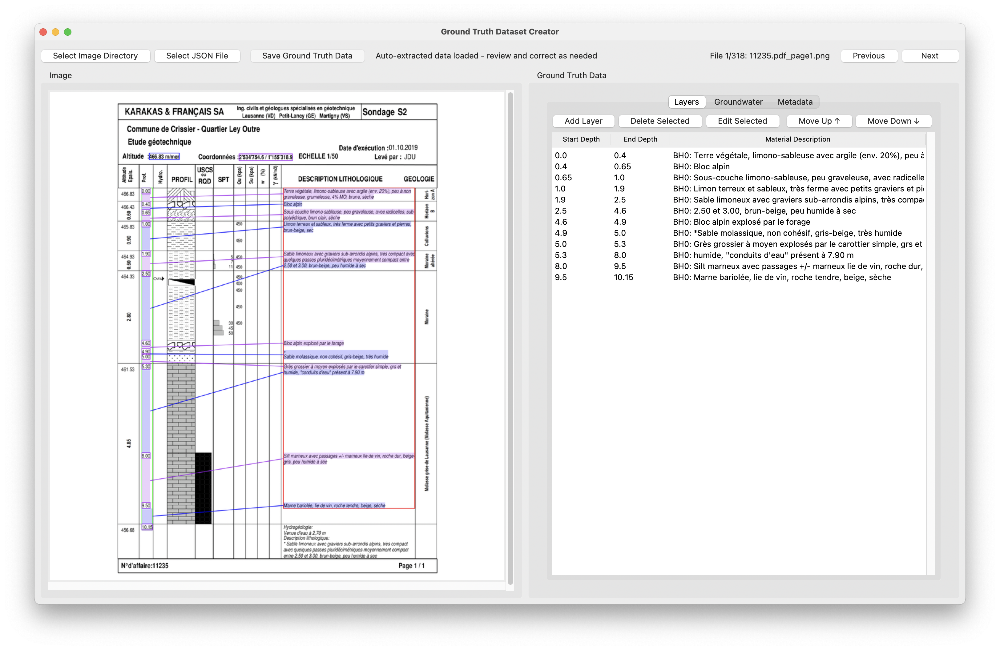

# How to use the Ground Truth GUI
The GUI made with `Tkinter` is located in `src/scripts/ground_truth_gui.py`. 

To launch the GUI:
```bash
source env/bin/activate
pip install tkinter
python src/scripts/ground_truth_gui.py 
```

{ width=400px }

On the left side of the screen is the current PNG, and on the right is the JSON data read from the file `predictions.json`.
If no edit is needed, press `ENTER` and this PNG, the original file as well as a dedicated `json` file will be saved to `data/output/ground_truth`.
If you want to edit a layer, select it then press the `Edit selected` button to edit the layer. A pop-up will then show so you can edit the fields.

> [!NOTE]  
> `BHx` means Borehole number x. In most files it's BH0 as there is only one borehole per poll.

> [!NOTE]  
> The pipeline makes it so if a PDF spans across multiple pages with different boreholes, it puts them in the same JSON.
> So if you see the depths returning to 0 in the same Ground Truth Data, look at the next pages to see if the PNG is there.

> [!TIP]
> If you create a new layer, you can move it up/down with the associated buttons.

If you wish to select the PNG from a different file than the default one, you can choose the path using the button on the top left. The same goes for the `json`.
* On the right side of the screen you will find 3 different tabs:
    * Layers: Describes every layer present on the analyzed PDF: `Start depth`, `End depth`, `Material Description`
    * Groundwater: If found in the file, it will be displayed with the `Date`, `Depth`, `Elevation`
    > [!TIP]
    > You can change the list of words to be considered as Groundwater in `config/matching_params.yml`
    * Metadata: The rest of the information found by the pipeline, such as the coordinates or the number of layers found
